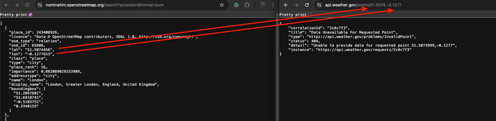
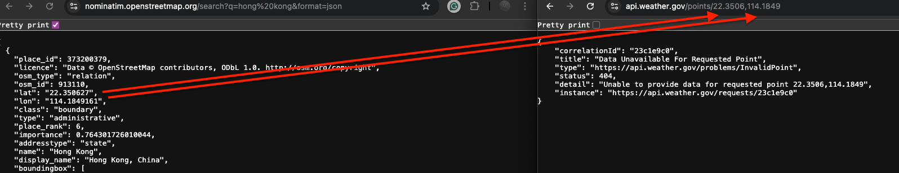

# ennismore-weather-app

The **Ennismore Weather App** is a simple RESTful API that provides weather forecasts for multiple cities. The app exposes a single endpoint, `/weather`, which allows users to retrieve weather data for a list of specified cities via a `GET` request.

## Features:
- Fetch weather forecast data for multiple cities at once.
- Supports query parameters to specify city names.
- JSON-formatted response with weather information.

## Usage:
To retrieve the weather forecast for specific cities, make a `GET` request to the `/weather` endpoint and pass the cities as a comma-separated list in the `city` query parameter.

### Example Request:
```bash
GET /weather?city=los%20angels,new%20york,chicago
```

### Example Response:
```json
{
    "forecast": [
        {
            "name": "cairo",
            "detail": [
                {
                    "startTime": "2024-09-23T18:00:00-05:00",
                    "endTime": "2024-09-24T06:00:00-05:00",
                    "description": "Showers and thunderstorms likely. Mostly cloudy. Low around 67, with temperatures rising to around 69 overnight. South wind around 5 mph. Chance of precipitation is 60%."
                },
                {
                    "startTime": "2024-09-24T18:00:00-05:00",
                    "endTime": "2024-09-25T06:00:00-05:00",
                    "description": "Mostly cloudy, with a low around 60. North northwest wind 1 to 6 mph."
                },
                {
                    "startTime": "2024-09-25T18:00:00-05:00",
                    "endTime": "2024-09-26T06:00:00-05:00",
                    "description": "A slight chance of rain showers before 7pm, then a chance of showers and thunderstorms. Partly cloudy, with a low around 59. North northeast wind around 5 mph. Chance of precipitation is 40%."
                }
            ]
        },
        {
            "name": "los angels",
            "detail": [
                {
                    "startTime": "2024-09-23T15:00:00-07:00",
                    "endTime": "2024-09-23T18:00:00-07:00",
                    "description": "Sunny, with a high near 84. West southwest wind around 10 mph."
                },
                {
                    "startTime": "2024-09-24T06:00:00-07:00",
                    "endTime": "2024-09-24T18:00:00-07:00",
                    "description": "Patchy fog before 11am. Mostly sunny, with a high near 83. Southwest wind 0 to 10 mph."
                },
                {
                    "startTime": "2024-09-25T06:00:00-07:00",
                    "endTime": "2024-09-25T18:00:00-07:00",
                    "description": "Patchy fog before 11am. Mostly sunny, with a high near 81. Southwest wind 0 to 10 mph."
                }
            ]
        }
    ]
}
```

### Query Parameters

city: A comma-separated list of city names for which you want to retrieve the weather forecast. The city names must be URL-encoded if they contain spaces or special characters (e.g., new york becomes new%20york).

```bash
GET /weather?city=cairo,los%20angels
```

## requirements
- go 1.22+
- docker

## Setup
Clone the repository.
Build and run the application:
- make run
The app will expose the /weather endpoint on port 8080.
- test: curl http://localhost:8080/weather\?city\=los%20angels,%20new%20york,chicago

## improvements

### code
- add documentation endpoint to be handled by server
- improve coverage of handler unit-tests
- add test for clients
- add tests for respository/cache
- review all log msgs
- due to time constraints I did not commit on each new module which is a bad practice!

### reliability and observability
- add retry mechanisms for client calls e.g. based on response like 503
- rate limiting and throttling
- add meaninful metrics based of the four Golden Signals(https://sre.google/sre-book/monitoring-distributed-systems/#xref_monitoring_golden-signals)
- add tracing(Jaeger)

### infra
- define k8s resources e.g. service,deployments, etc


## Note

The 3rd party APIs are acting weird e.g.
Retrieved Lat,Long from open maps api  returns not found in  weather api



ps:I'm looking forward to discussing the challenge solution and improvements! Any feedback is welcome!